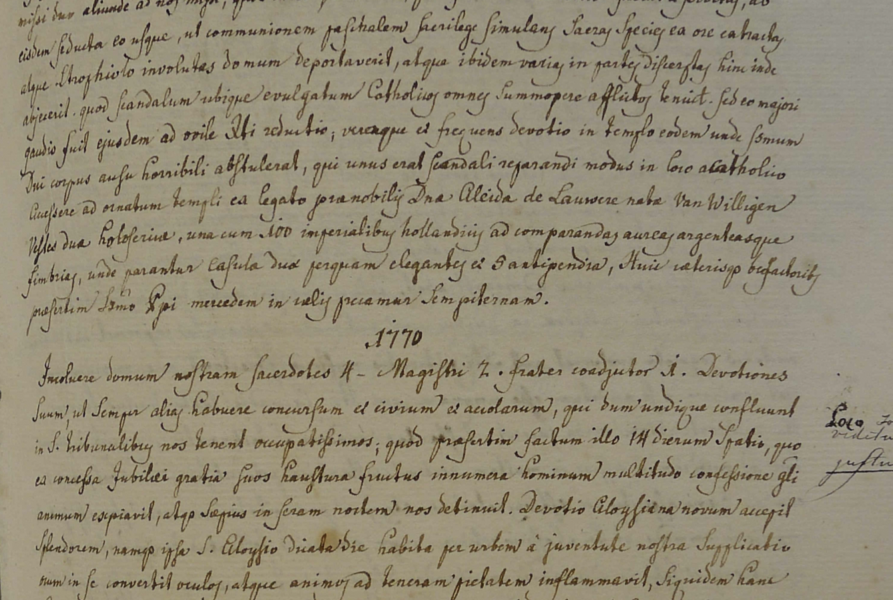

# Transkribus models
Images of example pages from Transkribus model training sets to make it easier to find a match.

## DAT 18. Jh M3b\_Pylaia
**Language:** German

**Description:** 19th century newspaper. Fraktur. 130 pages OCR correction and proofing. Print style for umlaut varies throughout (superscript "e" vs öäü). Since no applicable Pylaia model was available for training, the training set includes the HTR model data for DAT 18. Jh M1 and M2.

| Text | Tech | Words     | Lines | CER train     | CER validation     |
| :---    | :---    | :---        |    :----:   |          ---: |          ---: |
| Print | Pylaia | 102875      | 17029      | 0.50%   | 0.30%   |

| 110      | 166 | 181     | 201     |
| :---        |    :----:   |          ---: |          ---: |
|       |       |    |    |

## Pylaia\_NeoLatin\_Ravenstein
**Language:** NeoLatin

**Description:** This model is based on the transcription of the "Litterae Annuae Parochiae Ravensteijn SJ ab Anno 1643 ad Annum 1772".
The annual letters were kept at the Archivum Neerlandicum Societatis Iesu (Berchmannianum, Nijmegen) . These are now at the Catholic Document Center (Katholiek Documentatie Centrum (KADOC)) in Leuven, Belgium  (inventarisnummer 15.606).

Tom Gribnau photographed the manuscript; the transcriptions were made by Pim Boer, Leo Nellissen. 
This belongs to the publication: Tom Gribnau, Pim Boer, Leo Nellissen, Paul Begheyn SJ & Charles Caspers, Martiaal en theatraal. De jezuïeten in Ravenstein (1643-1772). Inleiding en vertaling van de jaarbrieven Nijmgen: Uitgeverij Valkhof Pers 2019; ISBN 978 90 5625 514 5)
More information can be found at: https://jaarbrieven.blogspot.com/ and https://www.stilus.nl/litterae/

T2I from the transcripts to Transkribus model has been done by Dr. C.A. Romein.

| Text | Tech | Words     | Lines | CER train     | CER validation     |
| :---    | :---    | :---         |    :----:   |          ---: |          ---: |
| Handwriting | Pylaia | 64435      | 6864      | 1.30%   | 4.00%   |

| 22      | 145 | 66     | 114     |
| :---        |    :----:   |          ---: |          ---: |
|       |       |    |    |

## German\_Kurrent_17th-18th
**Languages:** German, Latin, French

**Description:**  The model was trained with manuscripts of the 17th, 18th and few dates of the 19th century.  Occasionally, printed material from the same period were also included. In total, the Ground Truth is based on about 1500 individual handwritings, which come from the council minutes of the University of Greifswald, the assessor votes of the Wismar High Court, the minutes of the Pomeranian government of Stralsund, the responsa of the Greifswald Law Faculty and other archival holdings, such as private letter collections.

| Text | Tech | Words     | Lines | CER train     | CER validation     |
| :--- | :---     | :---        |    :----:   |          ---: |          ---: |
| Handwriting | Pylaia | 1839841      | 289857      | 6.00%   | 5.50%   |

No training images available.

## Manuscripts of Ethiopia and Eritrea
**Language:** Classical Ethiopic (Geʽez script)

**Description:**  Model for the transcription of Manuscripts of Ethiopia and Eritrea in Classical Ethiopic (Gǝʿǝz). Trained as part of the Beta maṣāḥǝft project 
and in order to feed a workflow to import transcriptions into the project's database.
Transcriptions for the training have been kindly provided by

 - Alessandro Bausi for ESum039, ff. 16vb-29va;
 - Antonella Brita for DAS002, 101va-110ra; 
 - Dorothea Reule for ESqdq004, ff. 97ra-101vb, 104ra-109rb.
 - Nafisa Valieva for BLorient718, ff. 1ra-7vb, images British Library.
- Several parts of manuscripts transcribed by Jeremy Brown and pertaining to the Miracle of the Cannibal of Qemer.

Importing of images and transcriptions in Transkribus has been done by Pietro Liuzzo

The project Beta maṣāḥǝft: Manuscripts of Ethiopia  and Eritrea (Schriftkultur des christlichen Äthiopiens  und Eritreas: eine multimediale Forschungsumgebung) is a long-term project funded within the framework of  the Academies' Programme (coordinated by the Union of the German Academies of Sciences and Humanities)  under survey of the Akademie der Wissenschaften in  Hamburg. The funding will be provided for 25 years,  from 2016–2040. The project is hosted by the Hiob  Ludolf Centre for Ethiopian Studies at the Universität  Hamburg. It aims at creating a virtual research environment that shall manage complex data related  to the predominantly Christian manuscript tradition  of the Ethiopian and Eritrean Highlands.

| Text | Tech | Words     | Lines | CER train     | CER validation     |
| :--- | :---     | :---        |    :----:   |          ---: |          ---: |
| Handwriting | HTR+ | 53830      | 16028      | 5.57%   | 5.16%   |

No training images available.

## Acta_17 PyLaia
**Languages:** German, Latin

**Description:** The PyLaia model was trained on the basis of more than 500,000 words from  about 1000 different writers during the period 1580-1705. It can handle the languages German, Low German and Latin and is able to decipher simple German and Latin abbreviations. Besides the usual chancery writings,  the training material also contained a  selection of concept writings and printed  material of the period.  The entire training material is based on  legal texts or court writings from the  Responsa of the Greifswald  Law Faculty. Validation sets are based on a chronological selection of the years: 1580 - 1705 . GT & validation set was produced by Dirk Alvermann, Elisabeth Heigl, Anna Brandt.

| Type | Words     | Lines | CER train     | CER validation     |
| :---     | :---        |    :----:   |          ---: |          ---: |
| Handwriting | Pylaia | 594628      | 102545      | 7.10%   | 5.16%   |

No training images available.

## Noscemus GM 3.0
**Languages:** Latin, Greek (German, Italian, English)

**Description:**
The "NOSCEMUS General Model" is able to read printed Latin text, especially from the 15th, 16th, 17th and 18th century. The model was released by Stefan Zathammer and it is based on training data coming from the Digital Sourcebook of the NOSCEMUS project (https://www.uibk.ac.at/projects/noscemus/)

For the 3rd revised and updated version a substantial amount of new pages was added, including prints from the 15th century and especially Greek texts.

Although the model is tailored towards transcribing (Neo-)Latin texts set in Antiqua-based typefaces, it is also, to a certain degree, able to handle Greek words and words set in (German) Fraktur.

The NOSCEMUS project has received funding from the European Research Council (ERC) under the European Union’s Horizon 2020 research and innovation programme (grant agreement No. 741374).

| Type | Words     | Lines | CER train     | CER validation     |
| :---     | :---        |    :----:   |          ---: |          ---: |
| Print | HTR+ | 448464      | 66575      | 0.40%   | 0.98%   |

No training images available.

## Acta_17 HTR+
**Language:** German, Latin

**Description:**
The HTR-model was trained on the basis of more than 500,000 words from about 1000 different writers during the period 1580-1705. It can handle the languages German, Low German and Latin and is able to decipher simple german and latin abbreviations. Besides the usual chancery writings, the training material also contained a selection of concept writings and printed  material of the period. The entire training material is based on legal texts or court writings from the  Responsa of the Greifswald  Law Faculty.

Validation sets are based on a chronological selection of the years: 1580 - 1705 . GT & validation set was produced by Dirk Alvermann, Elisabeth Heigl, Anna Brandt.

| Type | Words     | Lines | CER train     | CER validation     |
| :---     | :---        |    :----:   |          ---: |          ---: |
| Handwritten | HTR+ | 594628      | 102545      | 9.43%   | 6.30%   |

No training images available.

## Dutch\_Romantype_Pylaia
**Language:** Dutch Roman Print

**Description:**
This model is based on printed texts in the Roman font that was used in the Low Countries, during the 16th, 17th and 18th century. The type of sources used for this model, are books of ordinances, which contained the norms ('laws') at the time. 

This model has been the result of one of the KB National Library of the Netherlands Researcher-in-Residence position 2019. The project was called 'Entangled Histories'. 

For more information regarding the background of the model and how to cite it, please visit: https://lab.kb.nl/dataset/entangled-histories-ordinances-low-countries

| Type | Words     | Lines | CER train     | CER validation     |
| :---     | :---        |    :----:   |          ---: |          ---: |
| Print | Pylaia | 88105      | 13013      | 0.30%   | 1.40%   |

No training images available.
