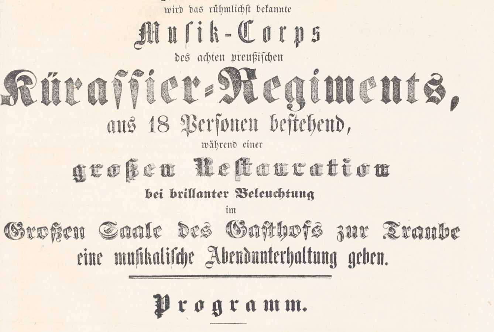

# Transkribus models
Images of example pages from Transkribus model training sets to make it easier to find a match.

## DAT 18. Jh M3b\_Pylaia_
**Language:** German
**Description:** 19th century newspaper. Fraktur. 130 pages OCR correction and proofing. Print style for umlaut varies throughout (superscript "e" vs öäü). Since no applicable Pylaia model was available for training, the training set includes the HTR model data for DAT 18. Jh M1 and M2.   

| 110      | 166 | 181     | 201     |
| :---        |    :----:   |          ---: |          ---: |
|       |       |    |    |