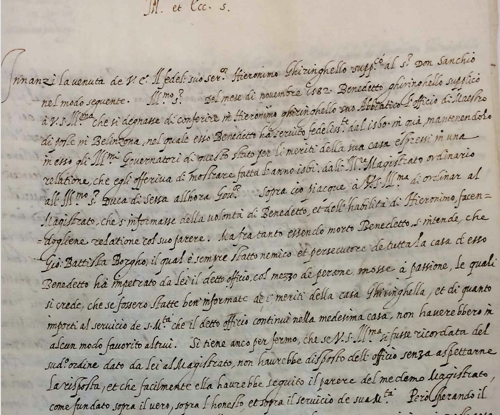
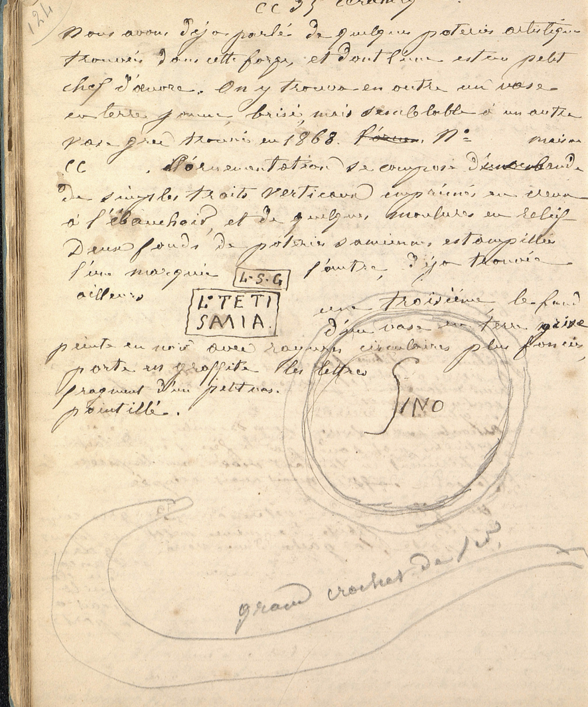
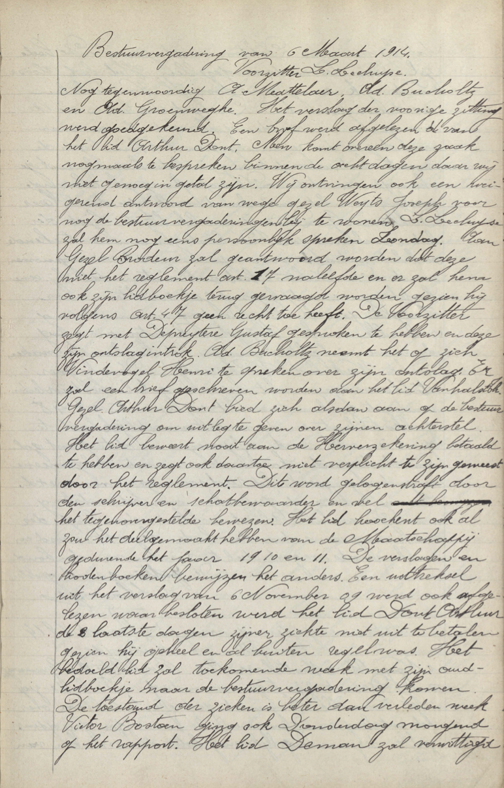

# Transkribus models
Descriptions, stats, and sample training data (where available) from public [Transkribus](https://transkribus.eu/) models, to help scholars find a model to work with.

If you have a model you'd like to have listed here (along with contact info so people can request access), please email Quinn at qad@stanford.edu.

## 18c Danish Administrative Writing
**Language:** Danish
**Description:** 
This model was made in a collaboration between Associate Professor Nina Javette Koefoed from Aarhus University and City Archivist Søren Bitsch Christensen and Archvist Kristian Pindstrup of Aarhus City Archive.

It is based on the model 18th Century Danish Prison Records v.5.1, which is also used as base model.  The primary training material consists of 18th Century protocols from the penitentiary on Møn. To increase the universality of the model, further training material has been added from the models "Various Danish Hands c. 1780 v. 1.13" by Associate Professor Johan Heinsen from Aalborg University and "17th Century Norwegian Court Records - Model Version 5" by former Senior Advisor Steve Jackson from the National Archival Services of Norway.

| Text | Tech | Words     | Lines | CER train     | CER validation     |
| :---    | :---    | :---        |    :----:   |          ---: |          ---: |
| Handwritten | HTR+ | 623268      | 103155     | 7.17%   | 5.93%   |

No training image samples available.

## 18c Danish Administrative Writing (PyLaia)
**Language:** Danish
**Description:** 
This model was made in a collaboration between Associate Professor Nina Javette Koefoed from Aarhus University and City Archivist Søren Bitsch Christensen and Archvist Kristian Pindstrup of Aarhus City Archive.

It is based on the model 18th Century Danish Prison Records v.5.1, which is also used as base model.  The primary training material consists of 18th Century protocols from the penitentiary on Møn. To increase the universality of the model, further training material has been added from the models "Various Danish Hands c. 1780 v. 1.13" by Associate Professor Johan Heinsen from Aalborg University and "17th Century Norwegian Court Records - Model Version 5" by former Senior Advisor Steve Jackson from the National Archival Services of Norway.

| Text | Tech | Words     | Lines | CER train     | CER validation     |
| :---    | :---    | :---        |    :----:   |          ---: |          ---: |
| Handwritten | PyLaia | 623268      | 103155     | 3.90%   | 6.00%   |

No training image samples available.

## 18th Century Danish 1.03
**Language:** Danish
**Description:** 
This model was trained by associate professor Johan Heinsen, Aalborg University. It was trained on handwriting from various military court records as well as court cases relating to inmates in various convict labour institutions in the eighteenth century. An example of the material can be found here: https://ao.sa.dk/ao/data.ashx?bid=80654798

Because the material deals mostly with soldiers and male convicts, the model has difficulty with pronouns. It also struggles dealing with hands that are highly slanted or overly compact.

| Text | Tech | Words     | Lines | CER train     | CER validation     |
| :---    | :---    | :---        |    :----:   |          ---: |          ---: |
| Handwritten | PyLaia | 288719      | 40646     | 5.61%   | 6.48%   |

No training image samples available.

## ASMi
**Language:** Italian
**Description:** 
Model trained on documents c.1560-1620 from the Archvio di Stato di Milano

| Text | Tech | Words     | Lines | CER train     | CER validation     |
| :---    | :---    | :---        |    :----:   |          ---: |          ---: |
| Handwritten | PyLaia | 11325      | 1082     | 0.91%   | 20.13%   |

**Ground Truth Examples**
| 9     | 14 | 52     |
| :---      |          ---: |          ---: |
|      |    |  |

## Acta_17 (extended)
**Language:** German, Latin

**Description:**
The HTR-model was trained on the basis of more than 1,500,000 words from  about 1300 different writers during the period 1580-1750. It can handle the languages German, Low German and Latin and is able to decipher simple german and latin abbreviations. Besides the usual chancery writings, the training material also contains a selection of concept writings and printed material of the period. The entire training material is based on legal texts or court writings from the Responsa of the Greifswald Law Faculty and the Wismar High Court.

Validation sets are based on a chronological selection of the years: 1580 - 1750 . GT & validation set was produced by Dirk Alvermann, Elisabeth Heigl, Anna Brandt, and Antje Laasch.

| Text | Tech | Words     | Lines | CER train     | CER validation     |
| :---    | :---    | :---        |    :----:   |          ---: |          ---: |
| Handwritten | HTR+ | 1632534      | 276418     | 10.52%   | 7.19%   |

No training image samples available.

## Acta_17 HTR+
**Language:** German, Latin

**Description:**
The HTR-model was trained on the basis of more than 500,000 words from about 1000 different writers during the period 1580-1705. It can handle the languages German, Low German and Latin and is able to decipher simple german and latin abbreviations. Besides the usual chancery writings, the training material also contained a selection of concept writings and printed  material of the period. The entire training material is based on legal texts or court writings from the  Responsa of the Greifswald  Law Faculty.

Validation sets are based on a chronological selection of the years: 1580 - 1705 . GT & validation set was produced by Dirk Alvermann, Elisabeth Heigl, Anna Brandt.

| Text | Tech | Words     | Lines | CER train     | CER validation     |
| :---    | :---    | :---        |    :----:   |          ---: |          ---: |
| Handwritten | HTR+ | 594628      | 102545      | 9.43%   | 6.30%   |

No training image samples available.

## Acta_17 PyLaia
**Languages:** German, Latin

**Description:** The PyLaia model was trained on the basis of more than 500,000 words from  about 1000 different writers during the period 1580-1705. It can handle the languages German, Low German and Latin and is able to decipher simple German and Latin abbreviations. Besides the usual chancery writings,  the training material also contained a  selection of concept writings and printed  material of the period.  The entire training material is based on  legal texts or court writings from the  Responsa of the Greifswald  Law Faculty. Validation sets are based on a chronological selection of the years: 1580 - 1705 . GT & validation set was produced by Dirk Alvermann, Elisabeth Heigl, Anna Brandt.

| Text | Tech | Words     | Lines | CER train     | CER validation     |
| :---    | :---    | :---        |    :----:   |          ---: |          ---: |
| Handwriting | Pylaia | 594628      | 102545      | 7.10%   | 5.16%   |

No training image samples available.

## Admiraliteit Zeeland 1605-1609 compleet
**Languages:** Dutch

**Description:** Civil affairs, 1605-1609, mainly customs

| Text | Tech | Words     | Lines | CER train     | CER validation     |
| :---    | :---    | :---        |    :----:   |          ---: |          ---: |
| Handwriting | HTR+ | 142715      | 20008      | 1.20%   | 1.12%   |

No training image samples available.

## Annuaires_Propietaires_Adr_Paris_1898_1923
**Languages:** French

**Description:** Annuaires_Propietaires_Adr_Paris_1898_1923

Directory of owners and properties in Paris and the Seine department.
Link in the BNF catalog: https://catalogue.bnf.fr/ark:/12148/cb32697229h
Paris Time Machine Consortium - TGIR Humanum
EHESS / CNRS / LATTICE / INRIA

169 pages in total of volumes 1898 and 1923 of the directory, the choice is made by alphabetical criterion because it is the mode of organization of the information in this document.
118 pages for training and 51 pages for validation.

| Text | Tech | Words     | Lines | CER train     | CER validation     |
| :---    | :---    | :---        |    :----:   |          ---: |          ---: |
| Handwriting | HTR+ | 72674      | 13285      | 0.29%   | 0.29%   |

**Ground Truth Examples**
| 1     | 83 | 101     |
| :---      |          ---: |          ---: |
|       |       |  |

## B2022 English Model M4
**Languages:** English

**Description:** English with some Latin characters.  By the Beyond 2022 project, Trinity College Dublin. Early 17th to late 19th century, 40 hands using Transkribus base model and 750,000 word ground truth. The model is particularly effective on secretary and copperplate texts and can be used as a base model for more cursive scripts.

| Text | Tech | Words     | Lines | CER train     | CER validation     |
| :---    | :---    | :---        |    :----:   |          ---: |          ---: |
| Handwriting | HTR+ | 759625      | 101297     | 7.84%   | 5.15%  |

No training image samples available.

## BBM Bulliot French C19th handwritten 2021
**Languages:** French

**Description:** Trained on he notebooks of Jacques-Gabriel Bulliot (1817-1902), who initiated the first excavations at  the Bibracte archaeological site  between 1867 and 1895 (https://bbm.hypotheses.org).

| Text | Tech | Words     | Lines | CER train     | CER validation     |
| :---    | :---    | :---        |    :----:   |          ---: |          ---: |
| Handwriting | HTR+ | 146466      | 23507     | 10.57%   | 7.73%  |

No training image samples available.

**Ground Truth Examples**
| 474     | 782 |
| :---        |    :----:  |
|       |     |

## BM_Kortrijk_M1+
**Languages:** Dutch

**Description:** Amsab-ISG, A World of Diamond

| Text | Tech | Words     | Lines | CER train     | CER validation     |
| :---    | :---    | :---        |    :----:   |          ---: |          ---: |
| Handwriting | HTR+ | 11915      | 1665     | 0.22%   | 2.53%  |

**Ground Truth Examples**
| 1     | 83 | 101     |
| :---      |          ---: |          ---: |
|       |       |  |

## Behrens_Peter_final
**Languages:** German

**Description:** Peter Behrens' handwriting based on letters to Richard and Ida Dehmel between the years 1899-1919.

| Text | Tech | Words     | Lines | CER train     | CER validation     |
| :---    | :---    | :---        |    :----:   |          ---: |          ---: |
| Handwriting | HTR+ | 10504      | 1851    | 0.58%   | 3.04% |

No training image samples available.

## BnF_Newseye_M2+
**Languages:** French

**Description:** The model works well with French script from late 18th century to mid of 20th century. For normal running text in French newspapers from that time error rates much below 1% were measured.

The model was created in the NewsEye project and is based on training data coming from the digital library Gallica of the French National Library (BnF).

Note: the model is trained on French language documents (French dailies, 1850-1945) and will therefore be less performant on other languages.

| Text | Tech | Words     | Lines | CER train     | CER validation     |
| :---    | :---    | :---        |    :----:   |          ---: |          ---: |
| Handwriting | HTR+ | 434100      | 67073    | 4.72%   | 2.73% |

No training image samples available.

## Charos V/ Charles V
**Languages:** Early modern Spanish - 15th century (1543)

**Description:** This HTR-model is based on the personal handwriting of Charles V of Spain. It is based upon political-institutional texts/ a letter of instructions to his son.
It is based upon the book: Rachael Ball and Geoffrey Parker (eds.), Cómo ser rey. Instrucciones del emperador Carlos V a su hijo Felipe. Mayo de 1543. Spanish-English bilingual edition; jointly published with the CSA and The Hispanic Society of America; 2014; ISBN 978-84-15245-45-2

Examples of the handwriting can be found at: [https://doi.org/10.5281/zenodo.5381739](https://doi.org/10.5281/zenodo.5381739)

Please cite this HTR+-model as: Rachael Ball, Geoffrey Parker,  the Hispanic Society of America, C.A Romein, Transkribus Public HTR+ Model: Carlos V/ Charles V Cómo ser rey_1543

| Text | Tech | Words     | Lines | CER train     | CER validation     |
| :---    | :---    | :---        |    :----:   |          ---: |          ---: |
| Handwriting | HTR+ | 9279      | 1603    | 0.39%   | 6.94% |

**Ground Truth Examples**
[

## Charter Scripts XIII-XV_M1
**Languages:** German, Latin, French

**Description:** Combination of GT of different charter scripts. From different projects and institutions. Aiming at building a generic model.

| Text | Tech | Words     | Lines | CER train     | CER validation     |
| :---    | :---    | :---        |    :----:   |          ---: |          ---: |
| Handwriting | HTR+ | 938325      | 55401    | 7.82%   | 6.32% |

No training image samples available.

## Combined_Full_VKS_2
**Languages:** Church Slavonic

**Description:** Training data consist of parts of the Russian Church Slavonic Great Reading Menology (16th century), Old Church Slavonic Codex Suprasliensis (11th century), and the 11th century manuscript of the Catecheses of Cyril of Jerusalem. This is a generic model suitable for transcribing a variety of Old Cyrillic script styles including uncial and semi-uncial.

| Text | Tech | Words     | Lines | CER train     | CER validation     |
| :---    | :---    | :---        |    :----:   |          ---: |          ---: |
| Handwriting | HTR+ | 393079      | 75422    | 4.44%   | 3.94% |

**Ground Truth Examples**
| 1     | 311 | 720     |
| :---      |          ---: |          ---: |
|       |       |  |

## Danish 1870-1950
**Language:** Danish

**Description:** General model for Danish Handwriting from late 19th and 20th Century. Based on the model RoyalDanishLibrary_20thCentury+ and parish council minutes from Aarhus City Archives.

Created by Jan Mattias Jonsson Agger at Aarhus City Archives based on work by volunteers at the City Archives and the work from Jakob K. Meile & the staff at the Royal Danish Library

| Text | Tech | Words     | Lines | CER train     | CER validation     |
| :---    | :---    | :---        |    :----:   |          ---: |          ---: |
| Handwritten | HTR+ | 348716    | 81959     | 5.23%   | 4.28%   |

No training image samples available.

## Danish 1870-1950 v3.5 
**Language:** Danish

**Description:** General Model for Danish handwriting from 1870-1950.

Newer incrementation of Danish 1870-1950 with added material and further experimentation with base models.

Using material from The Royal Danish Library, Aarhus City Archive, Faxe Archive, Næstved Archive and Gentofte Archive. 

| Text | Tech | Words     | Lines | CER train     | CER validation     |
| :---    | :---    | :---        |    :----:   |          ---: |          ---: |
| Handwritten | HTR+ | 1603622    | 372704     | 7.68%   | 5.91%   |

No training image samples available.

## Danish 1870-1950 v3.5 PyLaia
**Language:** Danish

**Description:** General Model for Danish handwriting by various hands from c. 1870-1950.

The same data as Danish 1870-1950 v3.5 but using the PyLaia engine instead of HTR+.

Created by Kristian Pindstrup & Jan Mattias Jonsson Agger at Aarhus City Archives.
Using available material from The Royal Danish Library as well as material from the work of the volunteers at Aarhus City Archive, Faxe Archive, Næstved Archive and Gentofte Archive who has transcribed various city and parish council minutes. 

More info in Danish on the project at  [http://retrodigitalisering.dk](http://retrodigitalisering.dk)

| Text | Tech | Words     | Lines | CER train     | CER validation     |
| :---    | :---    | :---        |    :----:   |          ---: |          ---: |
| Handwritten | Pylaia | 1603622    | 372704     | 5.20%   | 4.70%  |

No training image samples available.

## Danish Fraktur SB 19th century v.2.35

**Language:** Danish

**Description:** Danish Fraktur SB 19th century v.2.35
Based on 500+ pages from Royal Danish Court  & State Calendar several years, pages from Danish High Court Proceedings, a few pages from Danish news-papers and other from 19th century, all together based on the NZZ Gold Standard model. Trained on a total of 745.249 Fraktur words in Danish and German.

| Text | Tech | Words     | Lines | CER train     | CER validation     |
| :---    | :---    | :---        |    :----:   |          ---: |          ---: |
| Print | HTR+ | 30983    | 5349    | 0.28%   | 0.97%   |

**Ground Truth Examples**
| 4     | 37 | 55     | 56     |
| :---        |    :----:   |          ---: |          ---: |
|       |       |    |    |

## DAT 18. Jh M3b\_Pylaia
**Language:** German

**Description:** 19th century newspaper. Fraktur. 130 pages OCR correction and proofing. Print style for umlaut varies throughout (superscript "e" vs öäü). Since no applicable Pylaia model was available for training, the training set includes the HTR model data for DAT 18. Jh M1 and M2.

| Text | Tech | Words     | Lines | CER train     | CER validation     |
| :---    | :---    | :---        |    :----:   |          ---: |          ---: |
| Print | Pylaia | 102875      | 17029      | 0.50%   | 0.30%   |

**Ground Truth Examples**
| 110      | 166 | 181     | 201     |
| :---        |    :----:   |          ---: |          ---: |
|       |       |    |    |

## Devanagari mixed M1
**Language:** Hindi

**Description:** Devanagari script from several books late 19th early 20th century.

| Text | Tech | Words     | Lines | CER train     | CER validation     |
| :---    | :---    | :---        |    :----:   |          ---: |          ---: |
| Print | HTR | 25938      | 4258     | 4.12%   | 5.59%   |

**Ground Truth Examples**
| 3      | 50 | 105     | 200     |
| :---        |    :----:   |          ---: |          ---: |
|       |       |    |    |

## Devanagari_nagara_M1
**Language:** Hindi

**Description:** Devanagari script, early 20th century, NKP collection, p. 8-40, 60-80, 100-115

| Text | Tech | Words     | Lines | CER train     | CER validation     |
| :---    | :---    | :---        |    :----:   |          ---: |          ---: |
| Print | HTR | 19243      | 2092     | 0.46%   | 1.77%   |

**Ground Truth Examples**
| 1     | 38 | 68     |
| :---        |    :----:   |          ---: |
|       |       |   |

## DiJeSt for Hebrew Script Languages

**Language:** Hebrew, Yiddish, Ladino, Judeo-Arabic

**Description:** Trained on a mix of historic Hebrew scripts and languages, in the framework of the project DiJeSt. For details: 
http://dijest.net/gtmodel

| Text | Tech | Words     | Lines | CER train     | CER validation     |
| :---    | :---    | :---        |    :----:   |          ---: |          ---: |
| Print | HTR+ | 774192    | 79483    | 1.80%   | 1.56%   |

**Ground Truth Examples**
| 1     | 41 | 65     | 1322     |
| :---        |    :----:   |          ---: |          ---: |
|       |       |    |    |

## Dutch\_Gothic\_Print
**Language:** Dutch (16th, 17th, 18th century)

**Description:** This model is based on printed texts in the Gothic font that was used in the Low Countries, during the 16th, 17th and 18th century. The type of sources used for this model, are books of ordinances, which contained the norms ('laws') at the time. This model has been the result of one of the KB National Library of the Netherlands Researcher-in-Residence position 2019. The project was called 'Entangled Histories'. For more information regarding the background of the model and how to cite it, please visit: [https://lab.kb.nl/dataset/entangled-histories-ordinances-low-countries](https://lab.kb.nl/dataset/entangled-histories-ordinances-low-countries) 

| Text | Tech | Words     | Lines | CER train     | CER validation     |
| :---    | :---    | :---        |    :----:   |          ---: |          ---: |
| Print | HTR+ | 51143      | 7143      | 0.22%   | 1.71%  |

No training image samples available.

## Dutch\_Gothic\_Print_Pylaia
**Language:** Dutch Gothic

**Description:** This model is based on printed texts in the Gothic font that was used in the Low Countries, during the 16th, 17th and 18th century. The type of sources used for this model, are books of ordinances, which contained the norms ('laws') at the time. 

| Text | Tech | Words     | Lines | CER train     | CER validation     |
| :---    | :---    | :---        |    :----:   |          ---: |          ---: |
| Print | Pylaia | 51143      | 7143      | 0.20%   | 2.00%   |

No training image samples available.

## Dutch manuscript poetry 1603-1636
**Language:** Dutch

**Description:** Model trained on an extensive manuscript of early modern poetry, in separate hands (of which one is the most important) using different types of writing and special lay-outs (e.g. chronograms).
Author of the manuscript is a rhetorician (vernacular poet) from Mechelen, present-day Belgium, active in the first decades of the seventeenth century.  Training was based on a word count of over 50,000 words (more than 200 folios of text).

| Text | Tech | Words     | Lines | CER train     | CER validation     |
| :---    | :---    | :---        |    :----:   |          ---: |          ---: |
| Handwritten | HTR+ | 51788      | 7414     | 1.43%  | 4.78%   |

No training image samples available.

## Dutch Margaretha Turnor 17th Century

**Language:** Dutch

**Description:** This is the first model created by the Utrecht Archives. It is based on a thousand letters Margaretha Turnor wrote to her husband during the late 17th century. She managed the castle of Amerongen, while her husband worked abroad as a diplomat  for the Dutch Republic. Her letters provide an insight into family life in the Dutch Republic as well as the political situation in the country.

| Text | Tech | Words     | Lines | CER train     | CER validation     |
| :---    | :---    | :---        |    :----:   |          ---: |          ---: |
| Handwriting | HTR+ | 36289      | 4888     | 0.71%   | 1.83%   |

**Ground Truth Examples**
| 36      | 48 | 65     | 167     |
| :---        |    :----:   |          ---: |          ---: |
|       |       |    |    |

## Dutch Mountains (18th Century)

**Language:** Dutch

**Description:** Combination of the 18th Century models from the Amsterdam City Archives (3500+ scans of 15 notarial handwritings) and the National Archives of the Netherlands (3500+ scans of VOC handwritings).

| Text | Tech | Words     | Lines | CER train     | CER validation     |
| :---    | :---    | :---        |    :----:   |          ---: |          ---: |
| Handwritten | HTR+ | 1384893    | 235985    | 9.04%   | 5.67%   |

**Ground Truth Examples**
| 1      | 6521 | 6792     | 6962     |
| :---        |    :----:   |          ---: |          ---: |
|       |       |    |    |

## Dutch Mountains (18th Century)

**Language:** Dutch

**Description:** Combination of the 18th Century models from the Amsterdam City Archives (3500+ scans of 15 notarial handwritings) and the National Archives of the Netherlands (3500+ scans of VOC handwritings).
PyLaia

| Text | Tech | Words     | Lines | CER train     | CER validation     |
| :---    | :---    | :---        |    :----:   |          ---: |          ---: |
| Handwritten | PyLaia | 1384893    | 235985    | 9.04%   | 5.67%   |

**Ground Truth Examples**
| 1      | 6521 | 6792     | 6962     |
| :---        |    :----:   |          ---: |          ---: |
|       |       |    |    |

## Dutch Notarial Model 18th Century
**Language:** Dutch

**Description:** This is the first 18th Century general model created by the City Archives of Amsterdam. It is based on thousands of scans from in total 15 different notaries who worked in Amsterdam during the 18th Century.

All notaries (except Van Hoorn and Van Esterwege) have 10 scans validation included (2671 scans training, 130 validation)).

| Text | Tech | Words     | Lines | CER train     | CER validation     |
| :---    | :---    | :---        |    :----:   |          ---: |          ---: |
| Handwritten | HTR+ | 622904      | 116698     | 7.11%   | 5.32%   |

No training image samples available.

## Dutch\_Romantype_Print
**Language:** Dutch Roman Print

**Description:**
This model is based on printed texts in the Roman font that was used in the Low Countries, during the 16th, 17th and 18th century. The type of sources used for this model, are books of ordinances, which contained the norms ('laws') at the time. 

This model has been the result of one of the KB National Library of the Netherlands Researcher-in-Residence position 2019. The project was called 'Entangled Histories'. 

For more information regarding the background of the model and how to cite it, please visit: https://lab.kb.nl/dataset/entangled-histories-ordinances-low-countries

| Text | Tech | Words     | Lines | CER train     | CER validation     |
| :---    | :---    | :---        |    :----:   |          ---: |          ---: |
| Print | HTR+ | 88105      | 13013      | 0.74%  | 1.20%   |

No training image samples available.

## Dutch\_Romantype_Pylaia
**Language:** Dutch Roman Print

**Description:**
This model is based on printed texts in the Roman font that was used in the Low Countries, during the 16th, 17th and 18th century. The type of sources used for this model, are books of ordinances, which contained the norms ('laws') at the time. 

This model has been the result of one of the KB National Library of the Netherlands Researcher-in-Residence position 2019. The project was called 'Entangled Histories'. 

For more information regarding the background of the model and how to cite it, please visit: https://lab.kb.nl/dataset/entangled-histories-ordinances-low-countries

| Text | Tech | Words     | Lines | CER train     | CER validation     |
| :---    | :---    | :---        |    :----:   |          ---: |          ---: |
| Print | Pylaia | 88105      | 13013      | 0.30%   | 1.40%   |

No training image samples available.

## Dutch XVII Century

**Language:** Dutch

**Description:** Chronicling Novelty and the Amsterdam City Archives present a first collaboration for a general model for handwritings from the Low Countries in the 17th Century.

The Amsterdam City Archives contributed with 14 17th Century Amsterdam notarial handwritings, consisting of each maximum 290 scans training and	each 10 scan validation:
Bruijningh, Mathijsz, Westfrisius, Schaef, De Winter, Van der Groe, Anthony van de Ven, Van Sevenhoven, Des Pommare, Borsselaer, Pondt, De Vos, Joost van de Ven and Venkel.

Chronicling Novelty (https://chroniclingnovelty.com/) contributed with 20 17th Century handwritings from chronicles from nowadays Belgium and the Netherlands, consisting of minimum 10 and maximum 290 scans training material per handwriting, if possible with a validation set of 10 scans.
The following chronicles are included: Antwerpen (1643), Den Bosch (1604), Brugge (1675, 1684), Brussel (1681), Gent (1666, 1668, 1668), Hauwert (1636), Ieper (1695), Leeuwarden (1671, 1697), Mechelen (1657, 1665), De Rijp (1652), Rotterdam (1648, 1658, 1663, 1690) and Zwolle (1681).

| Text | Tech | Words     | Lines | CER train     | CER validation     |
| :---    | :---    | :---        |    :----:   |          ---: |          ---: |
| Handwritten | HTR+ | 1891025    | 331753    | 6.93%   | 6.28%   |

**Ground Truth Examples**
| 4051   | 4244 | 4480     | 4834     |
| :---        |    :----:   |          ---: |          ---: |
|       |       |    |    |

## Dutch XVII Century

**Language:** Dutch

**Description:** Chronicling Novelty and the Amsterdam City Archives present a first collaboration for a general model for handwritings from the Low Countries in the 17th Century.

The Amsterdam City Archives contributed with 14 17th Century Amsterdam notarial handwritings, consisting of each maximum 290 scans training and	each 10 scan validation:
Bruijningh, Mathijsz, Westfrisius, Schaef, De Winter, Van der Groe, Anthony van de Ven, Van Sevenhoven, Des Pommare, Borsselaer, Pondt, De Vos, Joost van de Ven and Venkel.

Chronicling Novelty (https://chroniclingnovelty.com/) contributed with 20 17th Century handwritings from chronicles from nowadays Belgium and the Netherlands, consisting of minimum 10 and maximum 290 scans training material per handwriting, if possible with a validation set of 10 scans.
The following chronicles are included: Antwerpen (1643), Den Bosch (1604), Brugge (1675, 1684), Brussel (1681), Gent (1666, 1668, 1668), Hauwert (1636), Ieper (1695), Leeuwarden (1671, 1697), Mechelen (1657, 1665), De Rijp (1652), Rotterdam (1648, 1658, 1663, 1690) and Zwolle (1681).

| Text | Tech | Words     | Lines | CER train     | CER validation     |
| :---    | :---    | :---        |    :----:   |          ---: |          ---: |
| Handwritten | PyLaia | 1890993    | 341783    | 11.70%   | 9.80%   |

**Ground Truth Examples**
| 4051   | 4244 | 4480     | 4834     |
| :---        |    :----:   |          ---: |          ---: |
|       |       |    |    |

## Edelfelt M13+
**Language:** Swedish

**Description:** 1867, 1873, 1881-1884, 1888-1901

| Text | Tech | Words     | Lines | CER train     | CER validation     |
| :---    | :---    | :---        |    :----:   |          ---: |          ---: |
| Handwritten | HTR+ | 438817     | 67412     | 3.77%   | 3.80%   |

**Ground Truth Examples**
| 1113      | 2389 | 2575     | 2710     |
| :---        |    :----:   |          ---: |          ---: |
|       |       |    |    |

## English Writing M1
**Language:** English

**Description:**
Based on Jeremy Bentham and secretaries from early 19th century. 50.000+ words.

| Text | Tech | Words     | Lines | CER train     | CER validation     |
| :---    | :---    | :---        |    :----:   |          ---: |          ---: |
| Handwritten | HTR | N/A      | N/A      | 4.54%   | 3.66%   |

No training image samples available.

## Estonian Court Records 19thC
**Language:** Estonian

**Description:** Model is based on Uue-Põltsamaa court records (vallakohus, gemeindegericht) 1852-1864 from Estonian National Archives.

| Text | Tech | Words     | Lines | CER train     | CER validation     |
| :---    | :---    | :---        |    :----:   |          ---: |          ---: |
| Handwritten | HTR+ | 56190     | 10204     | 0.68%   | 3.55%   |

**Ground Truth Examples**
| 36      | 42 | 68     | 173     |
| :---        |    :----:   |          ---: |          ---: |
|       |       |    |    |

## EvenkiRussian-RychkovArchive-v1.0

**Language:** Evenki, Russian

**Description:** Bilingual manuscripts by Konstantin Rychkov, 1910s. Parallel Evenki (Tungusic) and Russian texts. Cyrillic script with extensions.

This model is trained on Rychkov archive Folder 5 pp. 001-233.  No Base Model. Validation set 18 pages. 60 epochs. Acute accent disregarded.

Model trained in the INEL project ("Grammatical Descriptions, Corpora, and Language Technology for Indigenous Northern Eurasian Languages") https://inel.corpora.uni-hamburg.de/

Manuscripts from the archive of Konstantin Rychkov provided by the Institute of Oriental Manuscripts RAS http://www.orientalstudies.ru/

| Text | Tech | Words     | Lines | CER train     | CER validation     |
| :---    | :---    | :---        |    :----:   |          ---: |          ---: |
| Handwritten | HTR+ | 40561    | 9968    | 2.76%   | 2.91%   |

No training image samples available.

## French\_18thC_Pylaia
**Language:** French

**Description:** This model is based on printed texts in French (Romantype Font) that was used in Flanders (Low Countries), during the 18th century. The type of sources used for this model, are books of ordinances, which contained the norms ('laws') at the time. 

This model has been the result of one of the KB National Library of the Netherlands Researcher-in-Residence position 2019. The project was called 'Entangled Histories'. The books used for this specific model, have been provided by the Bodleian Library Oxford (RECUEIL DES ÉDITS, DÉCLARATIONS, LETTRES-PATENTES, &c. ENREGISTRÉS
AU PARLEMENT DE FLANDRES).

For more information regarding the background of the model and how to cite it, please visit: www.https://lab.kb.nl/dataset/entangled-histories-ordinances-low-countries 

| Text | Tech | Words     | Lines | CER train     | CER validation     |
| :---    | :---    | :---        |    :----:   |          ---: |          ---: |
| Print | Pylaia | 38487     | 3883      | 0.10%   | 0.91%   |

No training image samples available.

## German\_Kurrent_17th-18th
**Languages:** German, Latin, French

**Description:**  The model was trained with manuscripts of the 17th, 18th and few dates of the 19th century.  Occasionally, printed material from the same period were also included. In total, the Ground Truth is based on about 1500 individual handwritings, which come from the council minutes of the University of Greifswald, the assessor votes of the Wismar High Court, the minutes of the Pomeranian government of Stralsund, the responsa of the Greifswald Law Faculty and other archival holdings, such as private letter collections.

| Text | Tech | Words     | Lines | CER train     | CER validation     |
| :--- | :---     | :---        |    :----:   |          ---: |          ---: |
| Handwriting | Pylaia | 1839841      | 289857      | 6.00%   | 5.50%   |

No training image samples available.

## German\_Kurrent\_XIX\_pylaia
**Language:** German

**Description:** Large train and test set for german kurrent (19. century). GT from different projects and partners. Biased towards Swiss Documents.

| Text | Tech | Words     | Lines | CER train     | CER validation     |
| :---    | :---    | :---        |    :----:   |          ---: |          ---: |
| Handwritten | Pylaia | 5100439     | 764457      | 4.60%   | 6.90%   |

No training image samples available.

## Gothenburg\_police\_reports_1868-1902
**Language:** Swedish

**Description:** This model is trained from reports from the Gothenburg Police Detective department 1868-1902, held at the Swedish National Archives in Gothenburg. The groundtruth for the model training consists of transcribed spreads from 1873, 1880, 1888, and 1896.

| Text | Tech | Words     | Lines | CER train     | CER validation     |
| :---    | :---    | :---        |    :----:   |          ---: |          ---: |
| Handwritten | HTR+ | 165060    | 27931     | 2.85%   | 2.70%   |

**Ground Truth Examples**
| 318     | 364 | 385     | 422     |
| :---        |    :----:   |          ---: |          ---: |
|       |       |    |    |

## Italian Administrative Hands, 1550-1700

**Language:** Italian

**Description:** The Italian Administrative Hands model features a variety of Italian-language documents from state archives in Milan, Venice, Florence, Pisa, and Genoa. The training set represents a spectrum of humanistic, italic and cursive hands characteristic of administrative records, employed by secretaries and newswriters. The model has been trained to perform well with a mix of quantitative and qualitative information as well as many common proper nouns for the period, such as locations in Europe and contemporary rulers. Administrative documents often employ common superscript abbreviations, which the accompanying documentation treats in greater detail. The model can also be used with Latin, Spanish and French documents to some extent. The model represents a collaboration between Jake Dyble (Exeter/Pisa), Antonio Iodice (Exeter/Genoa), Sara Mansutti (Cork), and Rachel Midura (Virginia Tech). Documentation at https://emdigit.org/tool/2020/07/21/italian-administrative-hands.html.

| Text | Tech | Words     | Lines | CER train     | CER validation     |
| :---    | :---    | :---        |    :----:   |          ---: |          ---: |
| Handwritten | HTR+ | 67361     | 7193     | 9.15%   | 10.80%   |

No training image samples available.

## Manuscripts of Ethiopia and Eritrea
**Language:** Classical Ethiopic (Geʽez script)

**Description:**  Model for the transcription of Manuscripts of Ethiopia and Eritrea in Classical Ethiopic (Gǝʿǝz). Trained as part of the Beta maṣāḥǝft project 
and in order to feed a workflow to import transcriptions into the project's database.
Transcriptions for the training have been kindly provided by

 - Alessandro Bausi for ESum039, ff. 16vb-29va;
 - Antonella Brita for DAS002, 101va-110ra; 
 - Dorothea Reule for ESqdq004, ff. 97ra-101vb, 104ra-109rb.
 - Nafisa Valieva for BLorient718, ff. 1ra-7vb, images British Library.
- Several parts of manuscripts transcribed by Jeremy Brown and pertaining to the Miracle of the Cannibal of Qemer.

Importing of images and transcriptions in Transkribus has been done by Pietro Liuzzo

The project Beta maṣāḥǝft: Manuscripts of Ethiopia  and Eritrea (Schriftkultur des christlichen Äthiopiens  und Eritreas: eine multimediale Forschungsumgebung) is a long-term project funded within the framework of  the Academies' Programme (coordinated by the Union of the German Academies of Sciences and Humanities)  under survey of the Akademie der Wissenschaften in  Hamburg. The funding will be provided for 25 years,  from 2016–2040. The project is hosted by the Hiob  Ludolf Centre for Ethiopian Studies at the Universität  Hamburg. It aims at creating a virtual research environment that shall manage complex data related  to the predominantly Christian manuscript tradition  of the Ethiopian and Eritrean Highlands.

| Text | Tech | Words     | Lines | CER train     | CER validation     |
| :--- | :---     | :---        |    :----:   |          ---: |          ---: |
| Handwriting | HTR+ | 53830      | 16028      | 5.57%   | 5.16%   |

No training image samples available.

## Medieval Protocolbook 's-Hertogenbosch by Townclerck Petrus de Os sr., 1497-1542

**Language:** Latin, Dutch

**Description:** Protocolbook of the city of 's-Hertogenbosch, written by magister Petrus de Os sr., townclerck from 1497 until 1542. This protocolbook contains the minutes of the charters on voluntary jurisdiction

| Text | Tech | Words     | Lines | CER train     | CER validation     |
| :---    | :---    | :---        |    :----:   |          ---: |          ---: |
| Handwritten | HTR+ | 46638    | 3876    | 1.00%   | 4.11%   |

**Ground Truth Examples**
| 4     | 32 | 53     | 87     |
| :---        |    :----:   |          ---: |          ---: |
|       |       |    |    |

## NeoLatin\_Ravenstein_1643-1772

**Language:** Latin

**Description:** This model is based on the transcription of the "Litterae Annuae Parochiae Ravensteijn SJ ab Anno 1643 ad Annum 1772".
The annual letters were kept at the Archivum Neerlandicum Societatis Iesu (Berchmannianum, Nijmegen) . These are now at the Catholic Document Center (Katholiek Documentatie Centrum (KADOC)) in Leuven, Belgium  (inventarisnummer 15.606).

Tom Gribnau photographed the manuscript; the transcriptions were made by Pim Boer, Leo Nellissen. 
This belongs to the publication: Tom Gribnau, Pim Boer, Leo Nellissen, Paul Begheyn SJ & Charles Caspers, Martiaal en theatraal. De jezuïeten in Ravenstein (1643-1772). Inleiding en vertaling van de jaarbrieven Nijmgen: Uitgeverij Valkhof Pers 2019; ISBN 978 90 5625 514 5)
More information can be found at: https://jaarbrieven.blogspot.com/ and https://www.stilus.nl/litterae/

T2I from the transcripts to Transkribus model has been done by Dr. C.A. Romein

| Text | Tech | Words     | Lines | CER train     | CER validation     |
| :---    | :---    | :---        |    :----:   |          ---: |          ---: |
| Handwritten | HTR+ | 64435    | 6864    | 4.51%   | 3.58%   |

**Ground Truth Examples**
| 22      | 145 | 66     | 114     |
| :---        |    :----:   |          ---: |          ---: |
|       |       |    |    |

## Noscemus GM 2.2

**Language:** Latin, Greek, German et al.

**Description:** The "NOSCEMUS General Model" is able to read printed Latin text, especially from the 15th, 16th, 17th and 18th century. The model was released by Stefan Zathammer and it is based on training data coming from the Digital Sourcebook of the NOSCEMUS project (https://www.uibk.ac.at/projects/noscemus/)

For the 2nd revised and updated version a substantial amount of new pages was added, including prints from the 15th century, texts set in Fraktur and texts with a considerable amount of Greek passages.

Although the model is tailored towards transcribing (Neo-)Latin texts set in Antiqua-based typefaces, it is also, to a certain degree, able to handle Greek words and words set in (German) Fraktur.

The NOSCEMUS project has received funding from the European Research Council (ERC) under the European Union’s Horizon 2020 research and innovation programme (grant agreement No. 741374).

| Text | Tech | Words     | Lines | CER train     | CER validation     |
| :---    | :---    | :---        |    :----:   |          ---: |          ---: |
| Print | HTR+ | 345878    | 52459    | 0.39%   | 0.79%   |

No training image samples available.

## Noscemus GM 3.0
**Languages:** Latin, Greek (German, Italian, English)

**Description:**
The "NOSCEMUS General Model" is able to read printed Latin text, especially from the 15th, 16th, 17th and 18th century. The model was released by Stefan Zathammer and it is based on training data coming from the Digital Sourcebook of the NOSCEMUS project (https://www.uibk.ac.at/projects/noscemus/)

For the 3rd revised and updated version a substantial amount of new pages was added, including prints from the 15th century and especially Greek texts.

Although the model is tailored towards transcribing (Neo-)Latin texts set in Antiqua-based typefaces, it is also, to a certain degree, able to handle Greek words and words set in (German) Fraktur.

The NOSCEMUS project has received funding from the European Research Council (ERC) under the European Union’s Horizon 2020 research and innovation programme (grant agreement No. 741374).

| Text | Tech | Words     | Lines | CER train     | CER validation     |
| :---    | :---    | :---        |    :----:   |          ---: |          ---: |
| Print | HTR+ | 448464      | 66575      | 0.40%   | 0.98%   |

No training image samples available.

## Pylaia\_NeoLatin\_Ravenstein
**Language:** NeoLatin

**Description:** This model is based on the transcription of the "Litterae Annuae Parochiae Ravensteijn SJ ab Anno 1643 ad Annum 1772".
The annual letters were kept at the Archivum Neerlandicum Societatis Iesu (Berchmannianum, Nijmegen) . These are now at the Catholic Document Center (Katholiek Documentatie Centrum (KADOC)) in Leuven, Belgium  (inventarisnummer 15.606).

Tom Gribnau photographed the manuscript; the transcriptions were made by Pim Boer, Leo Nellissen. 
This belongs to the publication: Tom Gribnau, Pim Boer, Leo Nellissen, Paul Begheyn SJ & Charles Caspers, Martiaal en theatraal. De jezuïeten in Ravenstein (1643-1772). Inleiding en vertaling van de jaarbrieven Nijmgen: Uitgeverij Valkhof Pers 2019; ISBN 978 90 5625 514 5)
More information can be found at: https://jaarbrieven.blogspot.com/ and https://www.stilus.nl/litterae/

T2I from the transcripts to Transkribus model has been done by Dr. C.A. Romein.

| Text | Tech | Words     | Lines | CER train     | CER validation     |
| :---    | :---    | :---         |    :----:   |          ---: |          ---: |
| Handwriting | Pylaia | 64435      | 6864      | 1.30%   | 4.00%   |

**Ground Truth Examples**
| 22      | 145 | 66     | 114     |
| :---        |    :----:   |          ---: |          ---: |
|       |       |    |    |

## Transkribus print 0.1
**Language:** Danish, Dutch, German, Finnish, French, Latin, Swedish

**Description:** A first attempt to create a large model for printed historical documents. The model should be able to read historical Danish, Dutch, German, Finnish, French, Latin, and Swedish with good quality. Note: If you have printed material in other languages use this model as basemodel for training to speed up the creation of your special models.

| Text | Tech | Words     | Lines | CER train     | CER validation     |
| :---    | :---    | :---        |    :----:   |          ---: |          ---: |
| Print | HTR+ | 3661935    | 592933    | 2.18%   | 1.50%   |

No training image samples available.

## Transkribus Typewriter 0.1
**Language:** English, German, Dutch, Finnish

**Description:** General model for typewritten documents

| Text | Tech | Words     | Lines | CER train     | CER validation     |
| :---    | :---    | :---        |    :----:   |          ---: |          ---: |
| Print | HTR+ | 654961     | 73144     | 1.80%   | 1.28%   |

No training image samples available.

## Typewritten/print\_early_1900
**Language:** Dutch

**Description:** The National Archives Netherlands have made this model for typewritten and print writings which were used in the Netherlands during the late 19th and early 20th century.

For more information regarding the background of the model read this article (Dutch): https://www.nationaalarchief.nl/beleven/nieuws/klussen-aan-nieuw-tekstherkenningsmodel-transkribus-platform 

| Text | Tech | Words     | Lines | CER train     | CER validation     |
| :---    | :---    | :---        |    :----:   |          ---: |          ---: |
| Print | HTR+ | 72170     | 13700     | 1.65%   | 3.24%   |

**Ground Truth Examples**
| 59     | 94 | 108     | 191     |
| :---        |    :----:   |          ---: |          ---: |
|       |       |    |    |